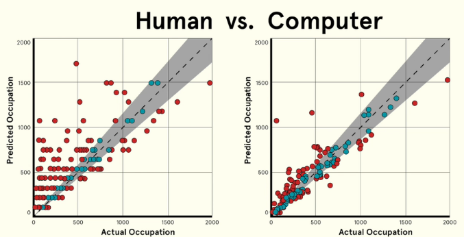

<!-- .slide: data-background="images/network-background.jpg" class="background" -->

<h2>The Institute for Ethical AI & ML</h2>
<h4>Insights, risks and impact of AI & ML in industry</h4>

   
   
    Alejandro Saucedo   
    <a href="http://twitter.com/AxSaucedo">@AxSaucedo</a> 
    <a href="http://linkedin.com/in/AxSaucedo">in/axsaucedo</a> 
   

[NEXT]
<!-- .slide: data-background="images/network-background.jpg" class="background" -->

<h2>The Institute for Ethical AI & ML</h2>
<h4>Insights, risks and impact of AI & ML in industry</h4>

<table class="bio-table">
  <tr>
    <td style="float: left">
        
         
        Alejandro Saucedo
         
         @AxSaucedo
         
    </td>
    <td style="float: left; color: white; font-size: 0.7em;">

         
        Chief Scientist
         
        <a style="color: cyan" href="http://e-x.io">The Institute for Ethical AI & ML</a
         
         
         
        

         
        Head of Solutions Eng. & Sci.
         
        <a style="color: cyan" href="http://eigentech.com">Eigen Technologies</a>
         
         
        Chief Technology Officer
         
        <a style="color: cyan" href="#">Hack Partners</a>
         
         
        Software Engineer
         
        <a style="color: cyan" href="#">Bloomberg LP.</a>

    </td>
  </tr>
  <tr>
  </tr>
</table>

[NEXT]
<!-- .slide: data-background="images/network-background.jpg" class="background" -->
## About the institute

We are a UK-based research centre formed by cross functional teams of applied STEM researchers, ethicists, and domain experts. 
 
 

We develop open source tools and industry standards to introduce accountability and mitigate risks in industrial use of emerging technologies.

[NEXT]
<!-- .slide: data-background="images/network-background.jpg" class="background smallquote" style="color: white" -->

## AI-RFX Procurement Framework

<ul>
     
    <li>
        A set of templates that support industry stakeholders procuring AI systems. 
    </li>
     
    <li>
        Built using our "Machine Learning Maturity Model".
    </li>
</ul> 

[NEXT]

<!-- .slide: data-background="images/network-background.jpg" class="background smallquote"  style="color: white"-->
## Open Source XAI Platform

<ul>
     
    <li>
        Open source platform to manage your data science processes in development and production.
    </li>
</ul> 

[NEXT]
<!-- .slide: data-background="images/network-background.jpg" class="background smallquote" -->

## Today

> Intuition on AI & ML
>  
>  
> Hands on live example
>
> Risks in ML
> 
> Impact in industry

#### Interactive session - feel free to ask Questions!

[NEXT]
<!-- .slide: data-background="images/particles.gif" class="background smallquote" -->

# #LetsDoThis

[NEXT SECTION]
<!-- .slide: data-background="images/partistat.png" class="background smallquote" style="color: white" -->

# 1. Intuition on AI, Machine Learning

[NEXT]
<!-- .slide: data-background="images/partistat.png" class="background smallquote" style="color: white" -->

## What you've heard:

* AI is going to take your job
* It's going to create a new job for you
* AI is outsmarting all humans
* Machine learning, deep learning...
* It's going to kill us all

[NEXT]
<!-- .slide: data-background="images/partistat.png" class="background smallquote" style="color: white" -->

## Let's go beyond the hype

The general label for a field of study, specifically
the study of whatever might answer the question of 
"What is required for a machine to exhibit intelligence"

[NEXT]
<!-- .slide: data-background="images/partistat.png" class="background smallquote" style="color: white" -->

## There 2 main approaches to AI

* Hard coding the rules (such as what you'd do in complex excel formulas)

## or

* Building systems that can "learn the rules" by learning from examples

[NEXT]
<!-- .slide: data-background="images/partistat.png" class="background smallquote" style="color: white" -->

## The "AI" most people refer to

The main sub-field that currently people refer to when they
talk about AI is the latter - **Machine Learning**

[NEXT]
<!-- .slide: data-background="images/partistat.png" class="background smallquote" style="color: white" -->

But machine learning has been there for a long time...

## Then why the hype now?

[NEXT]
<!-- .slide: data-background="images/partistat.png" class="background smallquote" style="color: white" -->

## Deep Learning

A branch of Machine Learning that has allowed engineers
and data scientists build systems that learn from data

#### Very very large amounts of data! 

[NEXT]
<!-- .slide: data-background="images/partistat.png" class="background smallquote" style="color: white" -->

## In essence, all Machine Learning is:

If give you examples, would you be able to learn to give the correct answers?

[NEXT]
<!-- .slide: data-background="images/partistat.png" class="background smallquote" style="color: white" -->
Given some input data, predict the correct output

Let's try to build a system to predict whether a shape is a square or a triangle

## How do we do this?

[NEXT]
<!-- .slide: data-background="images/partistat.png" class="background smallquote" style="color: white" -->
## First, let's visualise it

* Imagine a 2-d plot
* The x-axis is the area of the input shape
* The y-axis is the perimeter of the input shape

[NEXT]
<!-- .slide: data-transition="slide-in fade-out" data-background="images/partistat.png" class="background smallquote" style="color: white" -->
## We want to find a division line

 

The line defined by function
 
 
**$f(x̄) = mx̄ + b$**,  where:
 
 
**x̄** is input (area & perimeter) </li>
 
 
**m** and **b** are weights/bias
 

[NEXT]
<!-- .slide: data-transition="fade-in slide-out" data-background="images/partistat.png" class="background smallquote" style="color: white" -->
## So we can predict new data

 

The result **$f(x̄)$** states whether it's a triangle or square
 
 
(e.g. if it's larger than 0.5 it's triangle otherwise square)

 
 

[NEXT]
<!-- .slide: data-background="images/partistat.png" class="background smallquote" style="color: white" -->

So now let's start with a blank brain

[  ]

The machine knows nothing yet...

[NEXT]
<!-- .slide: data-background="images/partistat.png" class="background smallquote" style="color: white" -->
Now let's take some data examples

And let the machine do the learning

[NEXT]
<!-- .slide: data-transition="slide-in fade-out" data-background="images/partistat.png" class="background smallquote" style="color: white" -->
## The machine does the learning

We give it two examples (one square, one triangle)

[NEXT]
<!-- .slide: data-transition="fade-in" data-background="images/partistat.png" class="background smallquote" style="color: white" -->
## The machine does the learning

We give it more examples

[NEXT]
<!-- .slide:data-transition="fade-in slide-out" data-background="images/partistat.png" class="background smallquote" style="color: white" -->
## The machine does the learning

and more...

[NEXT]
<!-- .slide: data-background="images/partistat.png" class="background smallquote" style="color: white" -->
## Minimising loss function

We optimise the model by **minimising its loss**.

Keep adjusting the weights...

...until loss is not getting any smaller.

[NEXT]
<!-- .slide: data-transition="slide-in fade-out" data-background="images/partistat.png" class="background smallquote" style="color: white" -->
## Finding the weights!

When it finishes, we find optimised weights and biases

i.e. **$f(x̄)$ = triangle  if ($0.3 x̄ + 10$) > 0.5 else square**

[NEXT]
<!-- .slide: data-transition="fade-in slide-out" data-background="images/partistat.png" class="background smallquote" style="color: white" -->
## Now predict new data

We now have a system that "knows" how to differentiate triangles from squares

[NEXT]
<!-- .slide: data-background="images/partistat.png" class="background smallquote" style="color: white" -->
### But triangles and squares are boring...

[NEXT]
<!-- .slide: data-background="images/partistat.png" class="background smallquote" style="color: white" -->

### What do we do when we have more complex cases?

...way more complex!

[NEXT]
<!-- .slide: data-background="images/partistat.png" class="background smallquote" style="color: white" -->

We just need more flexible models...

...and more data...

### Much more data!

[NEXT]
<!-- .slide: data-background="images/partistat.png" class="background smallquote" style="color: white" -->

### Neural networks!

Remember our function `f(x) = mx + b`

This is the same function for a neuron (perceptron)

[NEXT]
<!-- .slide: data-background="images/partistat.png" class="background smallquote" style="color: white" -->
### Instead of just one neuron

[NEXT]
<!-- .slide: data-background="images/partistat.png" class="background smallquote" style="color: white" -->
### We just have many

This gives the function more flexibility

[NEXT]
<!-- .slide: data-background="images/partistat.png" class="background smallquote" style="color: white" -->
### With a few layers

This gives more flexibility for learning

[NEXT]
<!-- .slide: data-background="images/partistat.png" class="background smallquote" style="color: white" -->
#### But this technology has been out there for decades!

## Why the hype now?

[NEXT]
<!-- .slide: data-background="images/partistat.png" class="background smallquote" style="color: white" -->
### Deep Networks &mdash; many hidden layers

## Possible due to backprop!

[NEXT]
<!-- .slide: data-transition="slide-in fade-out" data-background="images/partistat.png" class="background smallquote" style="color: white" -->

[NEXT]
<!-- .slide: data-transition="fade-in" data-background="images/partistat.png" class="background smallquote" style="color: white" -->

[NEXT]
<!-- .slide: data-transition="fade-in" data-background="images/partistat.png" class="background smallquote" style="color: white" -->

[NEXT]
<!-- .slide: data-transition="fade-in slide-out" data-background="images/partistat.png" class="background smallquote" style="color: white" -->

[NEXT]
<!-- .slide: data-background="images/partistat.png" class="background smallquote" style="color: white" -->

You are now an expert on Machine Learning!

# Congratulations

#### You can pick up your certificates, valid in:

* Non-technical meetups
* Twitter discussions
* Linkedin Titles

[NEXT SECTION]
<!-- .slide: data-background-color="#262931" -->

# 2. A practical example

[NEXT SECTION]
<!-- .slide: data-background="images/space.jpg" class="background smallquote" style="color: white" -->

# 3. High level risks

[NEXT]
<!-- .slide: data-background="images/space.jpg" class="background smallquote" style="color: white" -->

## Synthetic Face Generation
<iframe width="560" height="315" data-src="https://www.youtube.com/embed/AmUC4m6w1wo?rel=0&amp;controls=0&amp;showinfo=0&amp;start=18&amp;autoplay=1" frameborder="0" allow="autoplay; encrypted-media" allowfullscreen></iframe>

[NEXT]
<!-- .slide: data-background="images/space.jpg" class="background smallquote" style="color: white" -->

## Synthetic Voice Generation
<iframe width="100%" height="300" scrolling="no" frameborder="no" allow="autoplay" data-src="https://w.soundcloud.com/player/?url=https%3A//api.soundcloud.com/tracks/318661840&color=%23ff5500&auto_play=true&hide_related=false&show_comments=true&show_user=true&show_reposts=false&show_teaser=true&visual=true"></iframe>

[NEXT]
<!-- .slide: data-background="images/space.jpg" class="background smallquote" style="color: white" -->
## Using bots on top of voice
<iframe width="560" height="315" data-src="https://www.youtube.com/embed/D5VN56jQMWM?rel=0&amp;controls=0&amp;showinfo=0&amp;start=60&amp;autoplay=1" frameborder="0" allow="autoplay; encrypted-media" allowfullscreen></iframe>

[NEXT]
<!-- .slide: data-background="images/space.jpg" class="background smallquote" style="color: white" -->
## And there's already a global bot industry
<iframe data-src="https://www.technologyreview.com/s/611123/inside-the-business-model-for-botnets/" style="width: 100%; height: 50vh"></iframe>

[NEXT]
<!-- .slide: data-background="images/space.jpg" class="background smallquote" style="color: white" -->

## Tricking Machine Learning Classifiers
<iframe width="560" height="315" data-src="https://www.youtube.com/embed/i1sp4X57TL4?rel=0&amp;controls=0&amp;showinfo=0&amp;autoplay=1" frameborder="0" allow="autoplay; encrypted-media" allowfullscreen></iframe>

[NEXT]
<!-- .slide: data-background="images/space.jpg" class="background smallquote" style="color: white" -->
# We could say
## AI has a Hallucination problem that’s hard to Fix...

[NEXT]
## It becomes a problem with cars...
<!-- .slide: data-background="images/space.jpg" class="background smallquote" style="color: white" -->
<iframe width="560" height="315" data-src="https://www.youtube.com/embed/c_5EH3CBtD0?rel=0&amp;controls=1&amp;showinfo=0&amp;start=60&amp;mute=1&amp;autoplay=1" frameborder="0" allow="autoplay; encrypted-media" allowfullscreen></iframe>

[NEXT]
## Did anyone say robots?
<!-- .slide: data-background="images/space.jpg" class="background smallquote" style="color: white" -->
<iframe width="560" height="315" data-src="https://www.youtube.com/embed/knoOXBLFQ-s?rel=0&amp;controls=1&amp;showinfo=0&amp;autoplay=1" frameborder="0" allow="autoplay; encrypted-media" allowfullscreen></iframe>

[NEXT]
## Or maybe drones...
<!-- .slide: data-background="images/space.jpg" class="background smallquote" style="color: white" -->
<iframe width="560" height="315" data-src="https://www.youtube.com/embed/TlO2gcs1YvM?rel=0&amp;controls=1&amp;showinfo=0&amp;autoplay=1&amp;start=47" frameborder="0" allow="autoplay; encrypted-media" allowfullscreen></iframe>

[NEXT]
<!-- .slide: data-background="images/space.jpg" class="background smallquote" style="color: white" -->
## Data is more personalised
<iframe width="560" height="315" data-src="https://www.youtube.com/embed/pon3zOxMH8M?rel=0&amp;controls=1&amp;showinfo=0&amp;autoplay=1&amp;start=18&amp;mute=1" frameborder="0" allow="autoplay; encrypted-media" allowfullscreen></iframe>

## (Company owned by Sergey Brin's wife)
<!-- .element: class="fragment" data-fragment-index="1" -->

[NEXT]
<!-- .slide: data-background="images/space.jpg" class="background smallquote" style="color: white" -->

## Regulatory frameworks playing catch-up (e.g. GDPR)
<iframe data-src="https://www.crowdemotion.co.uk/" style="width: 100%; height: 50vh"></iframe>

[NEXT]
<!-- .slide: data-background="images/space.jpg" class="background smallquote" style="color: white" -->

## What does this really look like in practice?
<iframe width="560" height="315" data-src="https://www.youtube.com/embed/HluANRwPyNo?rel=0&amp;controls=0&amp;showinfo=0&amp;start=0&amp;autoplay=1&amp;mute=0" frameborder="0" allow="autoplay; encrypted-media" allowfullscreen></iframe>

### Disclaimer: It's not that exciting

[NEXT SECTION]
<!-- .slide: data-background="images/spaceline.jpg" class="background smallquote" style="color: white" -->

# 4. Impact in industry

[NEXT]
<!-- .slide: data-background="images/spaceline.jpg" class="background smallquote" style="color: white" -->

## Core ML Applications

* Real time optimisation / Predictive analytics
* Strategic optimisation / Forecasting
* Radical personalisation
* Data analysis from (real) big data
* Automation of operational processes
* Anomality detection
* Information retrieval
* Unstructured data processing

[NEXT]
<!-- .slide: data-background="images/spaceline.jpg" class="background smallquote" style="color: white" -->

## Sectors:

| | | | |
| - | - | - | - |
| Automotive | Manufacturing | Consumer | Defense |
| Agriculture | Energy | Healthcare | Pharma | 
| Public | Media | Telecom | Transport |
| Education | Legal | Programming | Construction | 
| Space | Finance | Security | | 
| | | | |

[NEXT]
<!-- .slide: data-background="images/spaceline.jpg" class="background smallquote" style="color: white" -->

## Case studies today

| | | |
| - | - | - |
| Finance | Insurance | Property |
| | | |

[NEXT]
<!-- .slide: data-background="images/spaceline.jpg" class="background smallquote" style="color: white" -->
# Challenge
## Global US Investment Bank

* Regulatory compliance review required by regulator
* Millions of contracts across different sources
* Currently analysed manually
* Analysis requires legal domain knowledge
* Human error is in existence
* Process inefficient, expensive and prompt to error

[NEXT]
<!-- .slide: data-background="images/spaceline.jpg" class="background smallquote" style="color: white" -->
# Solution
## Global US Investment Bank

* Data integration to ingest from multiple sources
* Optical character recognition (OCR) to convert images
* Legal domain expertise converted into algorithmic inputs
* Machine learning model trained with examples
* Machine plus human review introduced

[NEXT]
<!-- .slide: data-background="images/spaceline.jpg" class="background smallquote" style="color: white" -->
# Impact
## Global US Investment Bank

* Increase in accuracy (70% -> 98%)
* Increase in speed from months to real time BAU
* Legal domain expertise commoditised
* In-depth metrcis on paralegal performance

[NEXT]
<!-- .slide: data-background="images/spaceline.jpg" class="background smallquote" style="color: white" -->
## Jevons Paradox

[NEXT]
<!-- .slide: data-background="images/spaceline.jpg" class="background smallquote" style="color: white" -->
# Challenge
## Global Insurance Organisation

* Thousands of insurance claims coming in
* Insurance claims analysed by domain experts
* Currently analysed manually
* Analysis requires domain expert knowledge
* Human error present
* Process inefficient, expensive and prompt to error

[NEXT]
<!-- .slide: data-background="images/spaceline.jpg" class="background smallquote" style="color: white" -->
# Solution
## Global Insurance Organisation

* Email ingestion through data pipelines 
* Attachments downloaded and processed
* Insurance domain expertise converted into algorithmic inputs
* Machine learning model trained with examples
* Machine plus human review introduced

[NEXT]
<!-- .slide: data-background="images/spaceline.jpg" class="background smallquote" style="color: white" -->
# Impact
## Global Insurance Organisation

* Increase in accuracy (70% -> 98%)
* Increase in speed from hours to real time BAU
* Large number of simple cases automated
* Insurance domain expertise commoditised
* Deeper insight on performance

[NEXT]
<!-- .slide: data-background="images/spaceline.jpg" class="background smallquote" style="color: white" -->
# Challenge
## Property Development

* Architect comes to client and suggests
* Hypothesis of good architecture, but can't check
* Builings developed in isolation
* Metrics to make decisions are only bi-/tri-variate
* Meeting space specifically is important but number of rooms is unknown
* Meetings are built in different formats
* Too many / too little rooms has bad effects

[NEXT]
<!-- .slide: data-background="images/spaceline.jpg" class="background smallquote" style="color: white" -->
# Solution
## Property Development

* Taking all the past buildings as a group of experiments
* Going back understand features for success / failure
* Take trends and learn from past buildings to make new buildings better
* Use historical data of current buildings and layouts
* Build labels of how space is used 
* Train machine learning model to learn model
* Predictions can tell what meetings to use and how many to use

[NEXT]
<!-- .slide: data-background="images/spaceline.jpg" class="background smallquote" style="color: white" -->
# Impact
## Property Development

[NEXT]
<!-- .slide: data-background="images/spaceline.jpg" class="background smallquote" style="color: white" -->
# Impact
## Property Development

[NEXT]
<!-- .slide: data-background="images/spaceline.jpg" class="background smallquote" style="color: white" -->
# General ML Flow

[NEXT SECTION]
<!-- .slide: data-background="images/network-background.jpg" class="background smallest" style="color: white" -->
# 5. Wrapping up

[NEXT]
<!-- .slide: data-background="images/network-background.jpg" class="background smallquote" -->

## Today we covered

> Intuition on AI & ML
>  
>  
> Hands on live example
>
> Risks in ML
> 
> Impact in industry

[NEXT]
<!-- .slide: data-background="images/network-background.jpg" class="background" -->
### Code
https://github.com/EthicalML/ai-impact-and-risks

### Slides
https://EthicalML.github.io/ai-impact-and-risks

[NEXT]
<!-- .slide: data-background="images/network-background.jpg" class="background" -->

<h2>The Institute for Ethical AI & ML</h2>
<h4>Insights, risks and impact of AI & ML in industry</h4>

<table class="bio-table">
  <tr>
    <td style="float: left">
        
         
        Alejandro Saucedo
         
         @AxSaucedo
         
    </td>
    <td style="float: left; color: white; font-size: 0.7em;">

         
        Chief Scientist
         
        <a style="color: cyan" href="http://e-x.io">The Institute for Ethical AI & ML</a
         
         
         
        

         
        Head of Solutions Eng. & Sci.
         
        <a style="color: cyan" href="http://eigentech.com">Eigen Technologies</a>
         
         
        Chief Technology Officer
         
        <a style="color: cyan" href="#">Hack Partners</a>
         
         
        Software Engineer
         
        <a style="color: cyan" href="#">Bloomberg LP.</a>

    </td>
  </tr>
  <tr>
  </tr>
</table>

